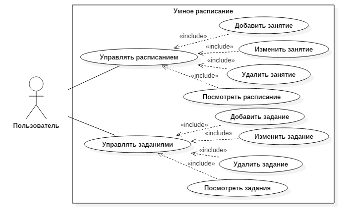

# Smart Schedule  

В наше время важным навыком стало умение грамотно распределять свое время. Особенно часто с такой задачей сталкиваются студенты и школьники. Оптимальным решением в данном случае может стать ведение учебного расписания и учет заданий, которые необходимо выполнить. 

## Задание
Реализовать приложение на Java, которое позволяет вводить и просматривать учебное расписание и домашние задания, необходимые выполнить к определенной дате.

## Концепция
Созданное приложение должно давать пользователю возможность ведения интерактивного расписания с возможность добавления, изменения и удаления занятий из расписания. Другой важно функциональностью является работа с заданиями, а именно их добавление, редактирование и удаление. Также расписание должно обладать графическим интерфейсом, который позволит визуализировать заявленную функциональность и упростить общение с программой.

## Минимально работоспособный продукт
Консольное приложение, позволяющее пользователю вводить и просматривать учебное расписание и домашние задания.

## Диаграмма прецедентов использования

## Диаграмма компонентов

## Результаты работы

